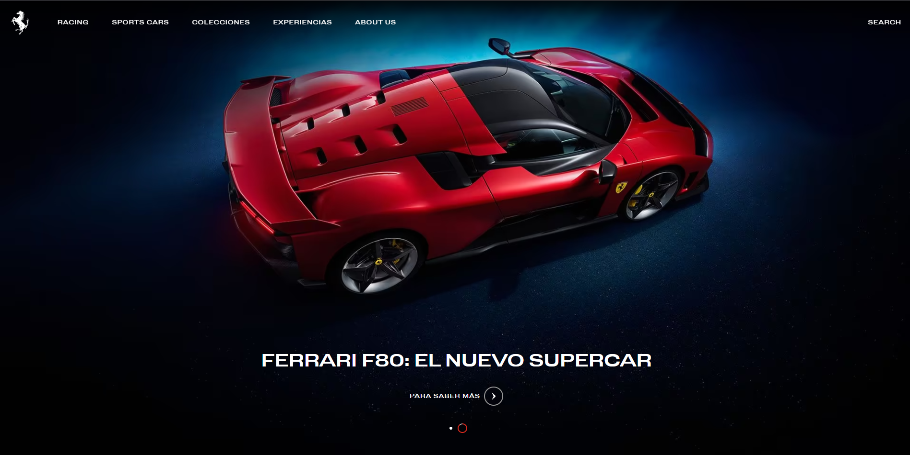
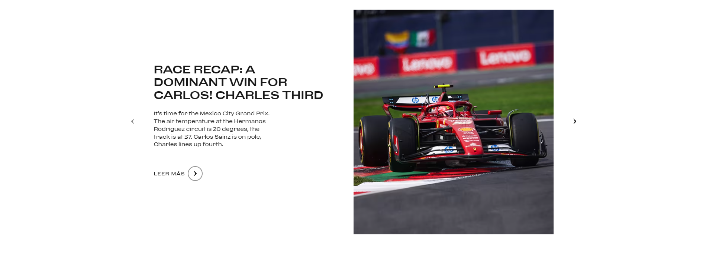
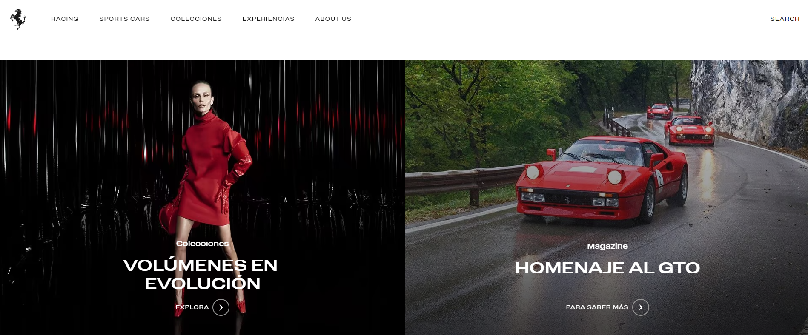

# Clases de Refuerzo Externo

En este repositorio se encontrarán los diferentes proyectos realizados con la finalidad de reforzar los conocimientos y pensamientos necesarios.

## Proyectos

| Nombre        | Link                                       | 
|---------------|-------------------------------------------|
| Ferrari Page  | [Ver proyecto](https://fca-class.vercel.app/car/index.html)  |

### Primer proyecto:
Clonar la apariencia de la página de [Ferrari](https://www.ferrari.com/es-ES)  

#### Actividad:
Con base en la explicación, realizar la maquetación de la siguiente sección:  

#### Tarea:
Traer realizada la siguiente sección:  
